# Axon Ivy PDF
*(formerly Docfactory)*

Axon Ivy PDF is a powerful utility library that provides comprehensive PDF manipulation capabilities for your Axon Ivy applications. This library enables you to perform a wide range of PDF operations including converting various formats to PDF, merging and splitting PDF files, extracting content, and performing advanced page operations.

**Key Features:**
- **Convert to PDF**: Transform HTML content and images into PDF documents. *If you want to convert from other formats, see [PDF Conversion](#pdf-conversion).*
- **Convert from PDF**: Export PDF files to other document formats (DOCX, PPTX, XLSX, etc.)
- **Merge PDFs**: Combine multiple PDF files into a single document
- **Split PDFs**: Divide PDF files into separate documents by page ranges
- **Extract Content**: Extract text and images from PDF documents
- **Page Operations**: Add watermarks, rotate pages, and manipulate PDF structure

## Important: Use PdfFactory for All Operations
**All PDF operations must use the `PdfFactory` class** to ensure proper Aspose license handling. Direct use of Aspose.PDF APIs without going through `PdfFactory` may result in unlicensed operation (evaluation mode) with functional limitations.

### License Management
The `PdfFactory` automatically handles Aspose.PDF licensing through Axon Ivy's third-party license service. No manual license configuration is required when using the factory methods.

For specific usage examples, refer to the demo processes included in the `axonivy-pdf-demo` module.

**Example Usage:**
```java
import com.axonivy.utils.axonivypdf.service.PdfFactory;

// For operations that return a value
var result = PdfFactory.get(() -> {
    // Your PDF operation code here
    return yourPdfOperation();
});

// For operations that don't return a value
PdfFactory.run(() -> {
    // Your PDF operation code here
    yourPdfOperation();
});
```

## Demo

The Axon Ivy PDF library includes comprehensive demo processes showcasing all available functionality:

### PDF Conversion

> **Note:** This utility supports converting PDF files to various document formats (DOCX, PPTX, XLSX, etc.). To convert other document types (DOC, DOCX, Excel) **to** PDF, please use:
> - [Axon Ivy Words](https://market.axonivy.com/axonivy-words) for Word documents
> - [Axon Ivy Cells](https://market.axonivy.com/axonivy-cells) for Excel spreadsheets

#### Convert HTML to PDF
Transform HTML content into professional PDF documents:

1. Upload an HTML file:

   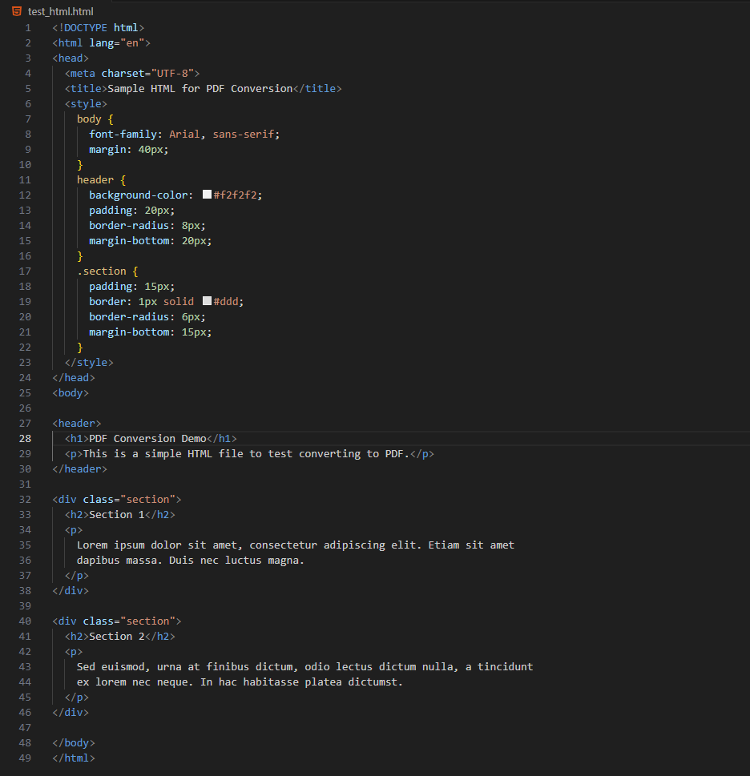

2. Press convert and download to get the file in PDF format:

   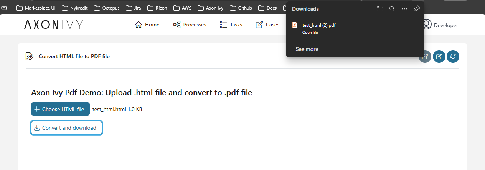

   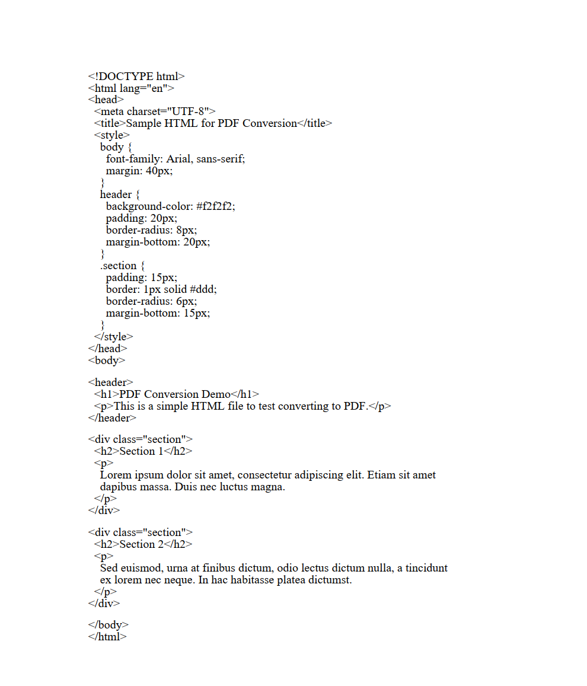

#### Convert Images to PDF
Create PDF files from image formats (PNG, JPEG, etc.)

1. Upload an image:

   

2. Press convert and download to get the file in PDF format:

   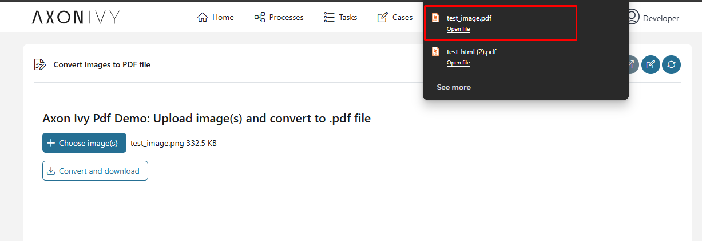

3. You can upload multiple images, and they will be merged into one file:

   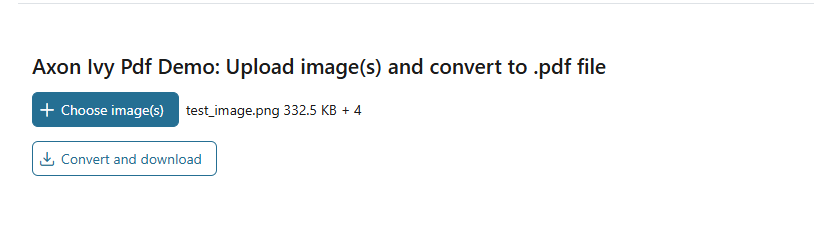

#### Convert PDF to Other Formats
Export PDFs to various document types including DOCX, PPTX, and XLSX

1. Upload a PDF file.

2. Choose the result type:

   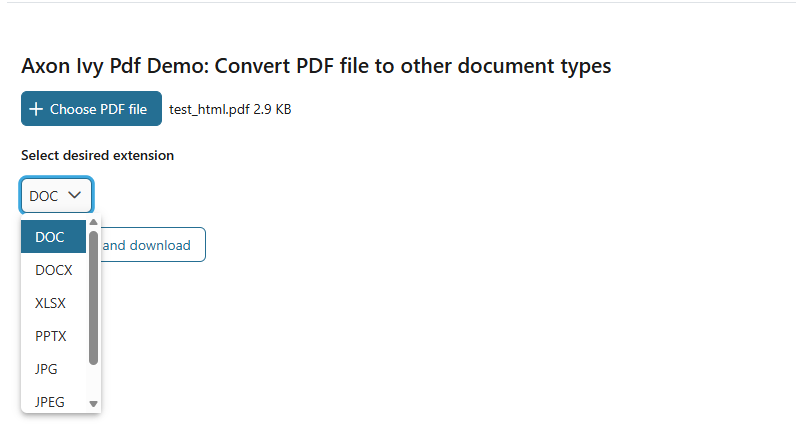

3. Press convert and download to get the file in the desired format:

   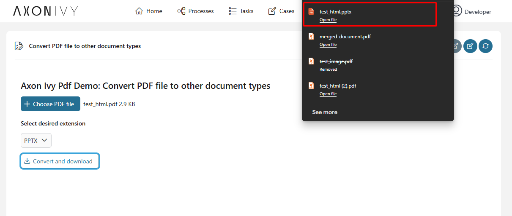

### PDF Manipulation

#### Merge PDF Files
Combine multiple PDF documents into a single file

1. Upload PDF files:

   

2. Press merge and download to get the merged result file:

   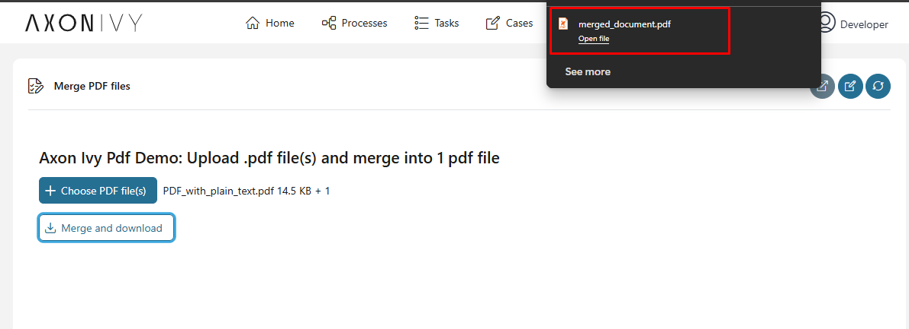

#### Split PDF
Divide PDF files by page ranges or extract specific pages

1. Upload a PDF file.

2. Select split criteria:

   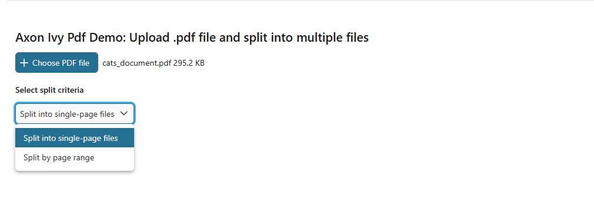

3. If **Split into single-page files** is chosen, the result file will be a zip file containing all the pages of the original document:

   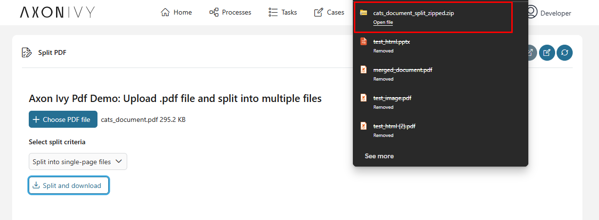

   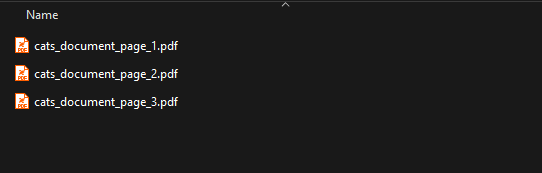

4. If **Split by page range** is chosen, determine the start page and end page of the result document:

   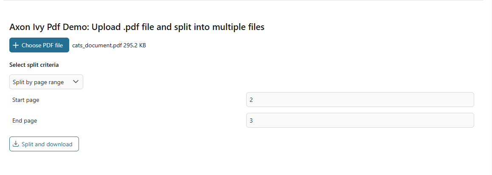

   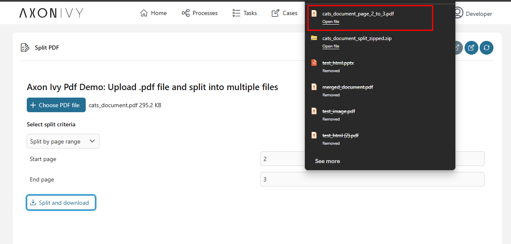

#### Page Operations
Add watermarks, rotate pages, and perform other page-level modifications

1. Upload a PDF file.

2. Choose which operation you want to perform:

   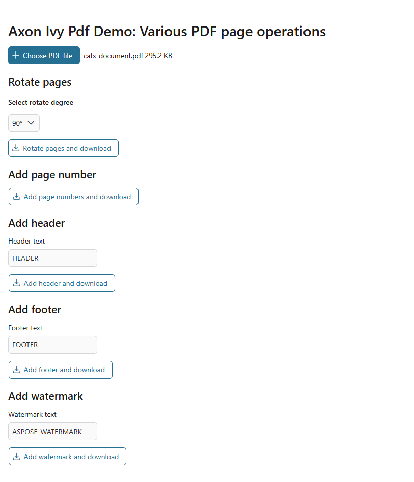

3. Rotate pages by selecting which rotate degree you want:

   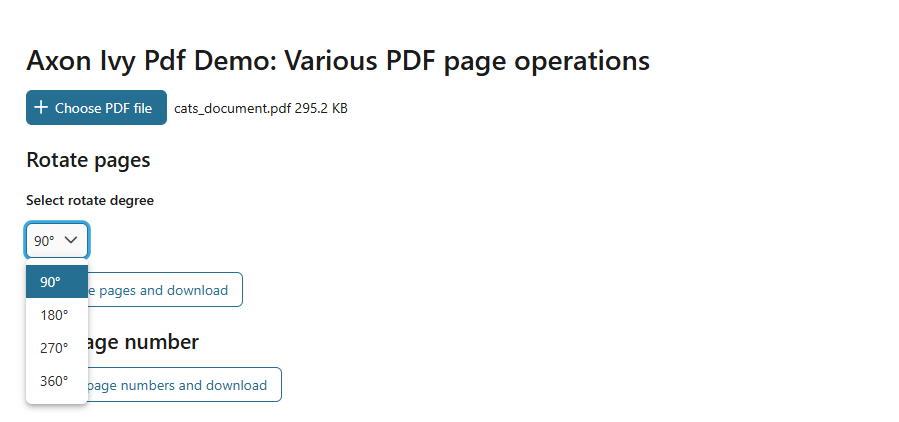

4. **Add page number** will add numbering to pages:

   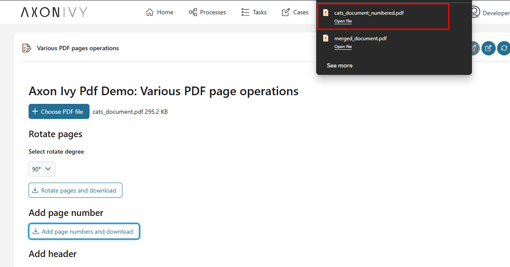

   

5. **Add header/footer** will add your desired text in the header/footer:

   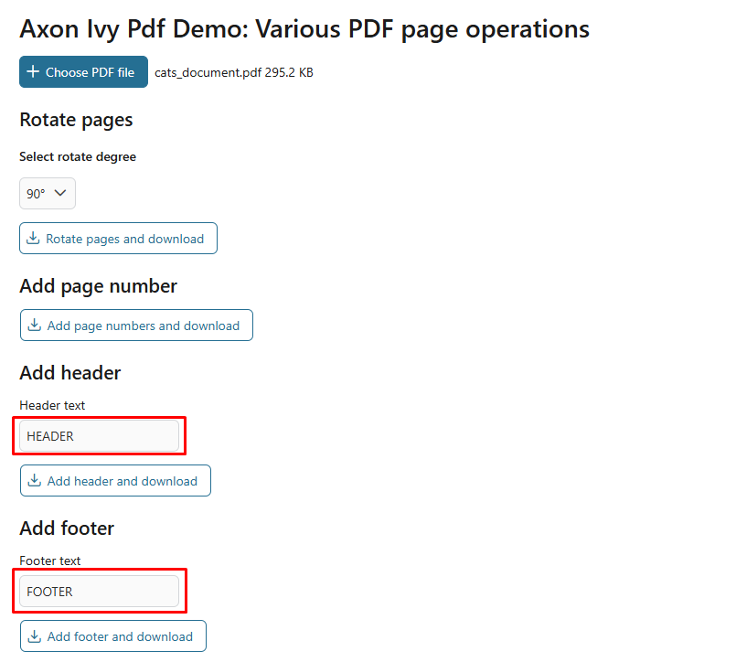

6. **Add watermark** will add your desired text as a watermark:

   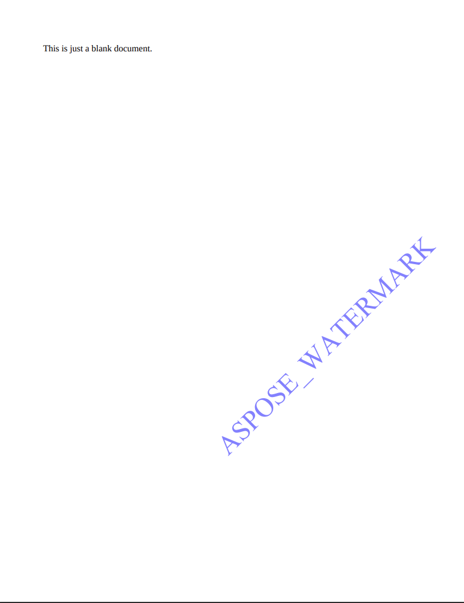

### Content Extraction

#### Extract Text from PDF
Retrieve text content from PDF documents

1. Upload a PDF file.

2. Select extract criteria:

   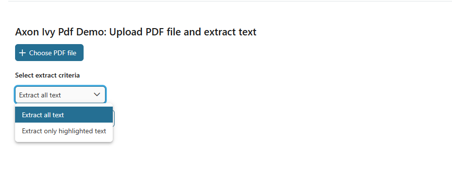

3. If **Extract all text** is chosen, all text from the document will be extracted:

   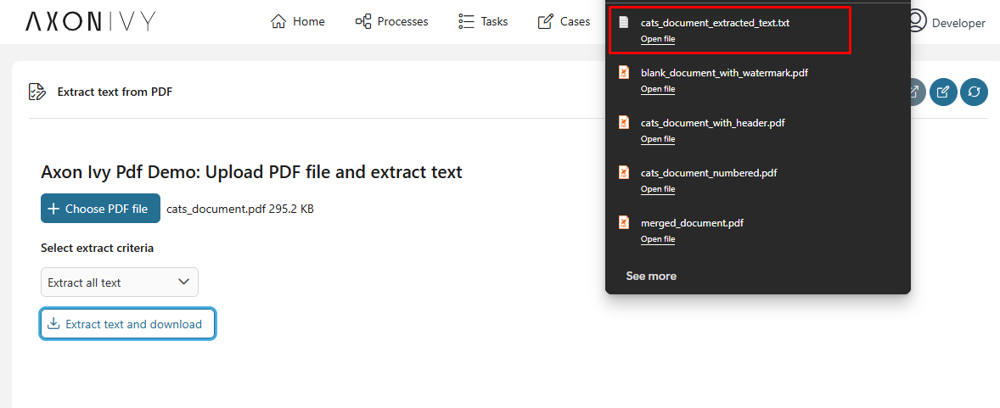

   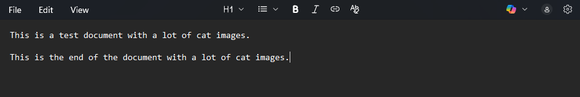

4. If **Extract highlighted text** is chosen, the highlighted text from the document will be extracted:

   

   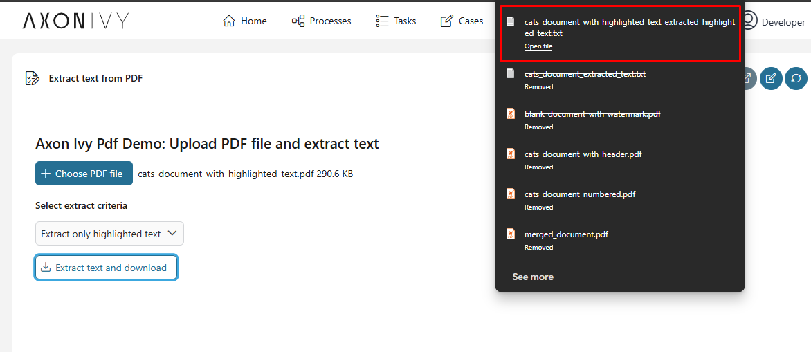

   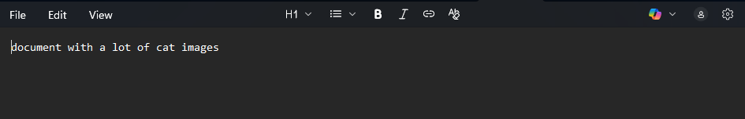

#### Extract Images from PDF
Export embedded images from PDF files

1. Upload a PDF file.

2. Press extract images and download to get a zip file containing all the images from the PDF file:

   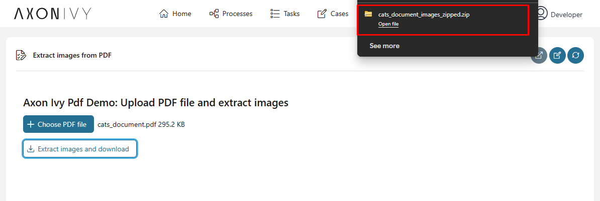

   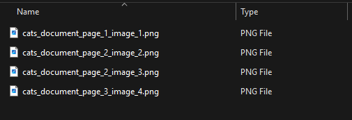
